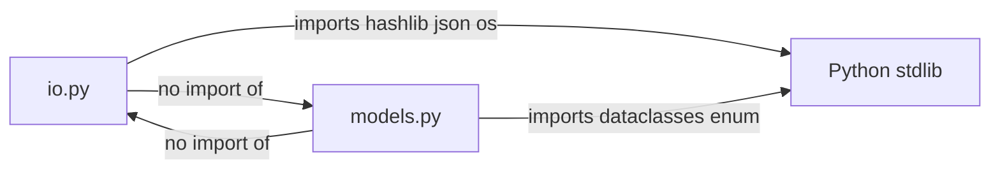

# T2 Implementation Plan — Data Models and Shared Utilities

Parent breakdown: [`plans/changelog-tool-task-breakdown.md`](plans/changelog-tool-task-breakdown.md:54)  
Spec: [`scripts/release-helper/vibe/specification.md`](scripts/release-helper/vibe/specification.md:273) (sections 5, 6.7, 8.4, 9.4, 10.1, 11.5)

## Goal

Define all shared data model dataclasses, enums, and utility functions that every
downstream task (T3–T11) will import. No pipeline logic lives here — only pure
data structures and helpers that have no external dependencies beyond the Python
standard library.

T2 is a **pure library task**: no CLI wiring, no file I/O to `.changelog/`, no
git calls, no network calls.

---

## Context: what already exists

| Already done | Location |
|---|---|
| T0 — CLI skeleton, three command stubs | [`scripts/release-helper/changelog_tool/cli.py`](scripts/release-helper/changelog_tool/cli.py:1) |
| T1 — Config dataclasses + loader | [`scripts/release-helper/changelog_tool/config.py`](scripts/release-helper/changelog_tool/config.py:1) |

T2 adds a new module `changelog_tool/models.py` and a new module
`changelog_tool/io.py`. Nothing in T0/T1 is modified.

---

## Files to create

```text
scripts/release-helper/changelog_tool/
├── models.py      # all data model dataclasses, enums, and pure helpers
└── io.py          # JSONL read/write, atomic file write, SHA checksum
```

---

## Module 1: `models.py`

### 1.1 Enums

#### `SizeBucket` (Spec §5.3)

```python
class SizeBucket(str, enum.Enum):
    TINY   = "tiny"    # <= 10
    SMALL  = "small"   # <= 50
    MEDIUM = "medium"  # <= 200
    LARGE  = "large"   # <= 1000
    HUGE   = "huge"    # > 1000
```

Inheriting `str` makes JSON serialisation trivial (`json.dumps` works without a
custom encoder).

#### `AutoClassificationReason`

```python
class AutoClassificationReason(str, enum.Enum):
    MERGE_COMMIT         = "merge_commit"
    DOCS_BY_SUBJECT      = "docs_by_subject"
    SMALL_OR_MEDIUM_BUGFIX = "small_or_medium_bugfix"
    SMALL_COMMIT         = "small_commit"
    REQUIRES_LLM_ANALYSIS = "requires_llm_analysis"
```

#### `LlmCategory`

```python
class LlmCategory(str, enum.Enum):
    FEATURE          = "feature"
    IMPROVEMENT      = "improvement"
    BREAKING_CHANGE  = "breaking_change"
    IMPORTANT_BUGFIX = "important_bugfix"
    INTERNAL         = "internal"
    DOCS             = "docs"
    TESTS            = "tests"
    CHORE            = "chore"
    UNCLEAR          = "unclear"
    # Pre-classification only (not returned by LLM):
    SMALL            = "small"
    MINOR_BUGFIX     = "minor_bugfix"
```

#### `ClassificationSource`

```python
class ClassificationSource(str, enum.Enum):
    AUTO = "auto"
    LLM  = "llm"
```

#### `Confidence`

```python
class Confidence(str, enum.Enum):
    HIGH   = "high"
    MEDIUM = "medium"
    LOW    = "low"
```

#### `ChangelogSection`

```python
class ChangelogSection(str, enum.Enum):
    BREAKING_CHANGES = "Breaking changes"
    FUNCTIONALITY    = "Functionality"
    IMPROVEMENTS     = "Improvements"
    BUG_FIXES        = "Bug fixes"
    DOCUMENTATION    = "Documentation"
    OTHER            = "Other"
```

---

### 1.2 Pure helper functions

#### `compute_size_score(insertions, deletions) -> int` (Spec §5.2)

```python
def compute_size_score(insertions: int, deletions: int) -> int:
    return insertions + deletions
```

#### `compute_size_bucket(size_score) -> SizeBucket` (Spec §5.3)

```python
def compute_size_bucket(size_score: int) -> SizeBucket:
    if size_score <= 10:
        return SizeBucket.TINY
    if size_score <= 50:
        return SizeBucket.SMALL
    if size_score <= 200:
        return SizeBucket.MEDIUM
    if size_score <= 1000:
        return SizeBucket.LARGE
    return SizeBucket.HUGE
```

#### `category_to_section(category) -> Optional[ChangelogSection]` (Spec §11.6)

Maps LLM categories to CHANGELOG sections. Returns `None` for categories that
are not included by default (`internal`, `tests`, `chore`, `unclear`, `small`,
`minor_bugfix`).

```python
_CATEGORY_TO_SECTION: dict[LlmCategory, ChangelogSection] = {
    LlmCategory.BREAKING_CHANGE:  ChangelogSection.BREAKING_CHANGES,
    LlmCategory.FEATURE:          ChangelogSection.FUNCTIONALITY,
    LlmCategory.IMPROVEMENT:      ChangelogSection.IMPROVEMENTS,
    LlmCategory.IMPORTANT_BUGFIX: ChangelogSection.BUG_FIXES,
    LlmCategory.DOCS:             ChangelogSection.DOCUMENTATION,
}

def category_to_section(category: LlmCategory) -> Optional[ChangelogSection]:
    return _CATEGORY_TO_SECTION.get(category)
```

---

### 1.3 Dataclasses

All dataclasses use `@dataclasses.dataclass`. Fields that may be absent at
early pipeline stages are typed `Optional[X]` with `default=None`.

#### `CoAuthor` (Spec §5.5, §7.4)

```python
@dataclasses.dataclass
class CoAuthor:
    name: str
    email: str
    github_login: Optional[str] = None        # filled at stage 2
    github_profile_url: Optional[str] = None  # filled at stage 2
    is_external: Optional[bool] = None        # filled at stage 2
```

#### `AutoClassification` (Spec §8.4)

```python
@dataclasses.dataclass
class AutoClassification:
    send_to_llm: bool
    reason: AutoClassificationReason
    category: Optional[LlmCategory]           # None when send_to_llm=True
    candidate_for_changelog: Optional[bool]   # None when send_to_llm=True
    changelog_line: Optional[str]
    confidence: Optional[Confidence]          # None when send_to_llm=True
```

#### `LlmClassification` (Spec §9.4)

```python
@dataclasses.dataclass
class LlmClassification:
    category: LlmCategory
    candidate_for_changelog: bool
    changelog_line: Optional[str]
    comment: Optional[str]
    confidence: Confidence
```

#### `Commit` (Spec §5.1)

The central entity. Fields are grouped by the pipeline stage that fills them.

```python
@dataclasses.dataclass
class Commit:
    # --- Stage 1 fields (always present after stage 1) ---
    sha: str
    short_sha: str
    is_merge_commit: bool

    author_name: str
    author_email: str
    co_authors: List[CoAuthor]

    subject: str
    body: str
    message: str
    commit_url: str

    changed_files: List[str]
    insertions: int
    deletions: int
    files_count: int
    size_score: int
    size_bucket: SizeBucket

    # --- Stage 2 fields (filled by contributor resolution) ---
    github_login: Optional[str] = None
    github_profile_url: Optional[str] = None
    is_external: Optional[bool] = None

    # --- Stage 3 field (filled by pre-classification) ---
    auto_classification: Optional[AutoClassification] = None

    # --- Stage 4 field (filled by LLM classification) ---
    llm_classification: Optional[LlmClassification] = None
```

#### `VerifiedCommit` (Spec §10.1)

The merged, unified object produced by stage 5.1. Kept separate from `Commit`
to make the type system enforce that verification has run.

```python
@dataclasses.dataclass
class VerifiedCommit:
    sha: str
    short_sha: str

    subject: str
    body: str
    commit_url: str

    author_name: str
    author_email: str
    github_login: Optional[str]
    github_profile_url: Optional[str]
    is_external: bool
    co_authors: List[CoAuthor]

    changed_files: List[str]
    insertions: int
    deletions: int
    files_count: int
    size_score: int
    size_bucket: SizeBucket

    classification_source: ClassificationSource
    category: LlmCategory
    candidate_for_changelog: bool
    changelog_line: Optional[str]
    classification_comment: Optional[str]
    confidence: Confidence

    # Populated by stage 5.2 attention-flag logic
    attention_flags: List[str] = dataclasses.field(default_factory=list)
    is_merge_commit: bool = False
```

#### `ChangelogItem` (Spec §11.5)

```python
@dataclasses.dataclass
class ChangelogItem:
    sha: str
    short_sha: str
    category: LlmCategory
    changelog_section: ChangelogSection
    changelog_line: str
    author_login: Optional[str]
    author_profile_url: Optional[str]
    co_authors: List[CoAuthor]
    is_external: bool
    commit_url: str
    source: ClassificationSource
    maintainer_comment: Optional[str] = None
    attention_flags: List[str] = dataclasses.field(default_factory=list)
```

---

### 1.4 Serialisation helpers

Each dataclass needs round-trip JSON serialisation. The approach:

- `to_dict(obj) -> dict` — recursively converts dataclasses and enums to plain
  Python dicts/lists/scalars. Used before `json.dumps`.
- `commit_from_dict(d: dict) -> Commit` — reconstructs a `Commit` from a plain
  dict (used when reading JSONL). Similarly `verified_commit_from_dict`,
  `changelog_item_from_dict`.

Design decision: keep these as **module-level functions** (not `__post_init__`
or classmethods) so they are easy to test in isolation and easy to evolve
without touching the dataclass definitions.

```python
def to_dict(obj: Any) -> Any:
    """Recursively convert dataclasses/enums to JSON-serialisable types."""
    if dataclasses.is_dataclass(obj) and not isinstance(obj, type):
        return {k: to_dict(v) for k, v in dataclasses.asdict(obj).items()}
    if isinstance(obj, enum.Enum):
        return obj.value
    if isinstance(obj, list):
        return [to_dict(i) for i in obj]
    return obj
```

`from_dict` functions are written per-type (not generic) because each type has
optional fields and enum coercions that benefit from explicit handling.

---

## Module 2: `io.py`

### 2.1 SHA checksum (Spec §6.7)

```python
def compute_sha_checksum(sha_list: Iterable[str]) -> str:
    """sha256 of sorted, newline-joined full SHA values."""
    joined = "\n".join(sorted(sha_list))
    return hashlib.sha256(joined.encode()).hexdigest()
```

### 2.2 JSONL helpers

```python
def write_jsonl(path: str, records: Iterable[Any]) -> None:
    """Write an iterable of JSON-serialisable dicts to a JSONL file."""

def read_jsonl(path: str) -> List[dict]:
    """Read a JSONL file and return a list of parsed dicts."""
```

Both raise `IOError` / `json.JSONDecodeError` on failure — callers handle
errors at the command level.

### 2.3 Atomic file write

```python
def write_json_atomic(path: str, data: Any) -> None:
    """Write JSON to a temp file in the same directory, then rename atomically."""
```

Uses `tempfile.NamedTemporaryFile` + `os.replace` (atomic on POSIX and Windows
≥ Vista). Ensures that a crash mid-write never leaves a half-written state file.

### 2.4 Workdir helper

```python
def ensure_workdir(workdir: str) -> None:
    """Create the workdir and workdir/logs/ if they do not exist."""
    os.makedirs(workdir, exist_ok=True)
    os.makedirs(os.path.join(workdir, "logs"), exist_ok=True)
```

---

## File layout after T2

```text
scripts/release-helper/changelog_tool/
├── __init__.py          (unchanged)
├── __main__.py          (unchanged)
├── cli.py               (unchanged)
├── config.py            (unchanged — T1)
├── models.py            ← NEW
├── io.py                ← NEW
└── commands/
    ├── __init__.py      (unchanged)
    ├── collect.py       (unchanged stub)
    ├── review.py        (unchanged stub)
    └── report.py        (unchanged stub)
```

---

## Dependency graph within T2



`models.py` and `io.py` are intentionally **independent of each other**.
Callers (T3+) import both and compose them.

---

## What T2 does NOT include

| Excluded | Reason / Task |
|---|---|
| Git subprocess calls | T3 |
| GitHub API calls | T4 |
| Heuristic classification logic | T5 |
| LLM client / prompt building | T6 |
| Any file writes to `.changelog/` | T3+ |
| Attention-flag computation | T9 |
| Override YAML parsing | T9 |
| Verification logic | T8 |

---

## Testing approach

T2 is pure Python with no I/O side-effects (except `io.py` which touches the
filesystem). Tests should cover:

- `compute_size_score` and `compute_size_bucket` boundary values (0, 10, 11,
  50, 51, 200, 201, 1000, 1001).
- `category_to_section` for every `LlmCategory` value.
- `compute_sha_checksum` — order independence (same result regardless of input
  order), known SHA → known digest.
- `to_dict` round-trip for `Commit`, `VerifiedCommit`, `ChangelogItem`.
- `write_jsonl` / `read_jsonl` round-trip.
- `write_json_atomic` — file appears atomically (no partial file on simulated
  crash is hard to test, but at minimum verify the file is written correctly).
- `ensure_workdir` creates both `workdir/` and `workdir/logs/`.

Tests live in `scripts/release-helper/tests/test_models.py` and
`scripts/release-helper/tests/test_io.py` (new files, no test runner
infrastructure required by T2 itself — that is T12).

---

## Done criteria

- `models.py` exports all enums, dataclasses, and pure helpers listed above.
- `io.py` exports `compute_sha_checksum`, `write_jsonl`, `read_jsonl`,
  `write_json_atomic`, `ensure_workdir`.
- A `Commit` object can be serialised to a dict and reconstructed from that
  dict without data loss.
- `compute_sha_checksum` produces the same result regardless of input order.
- `write_json_atomic` never leaves a partial file on disk.
- No imports of `config.py`, `cli.py`, or any command module from `models.py`
  or `io.py` (dependency direction is strictly downward).
- All public names are listed in `__all__` in both modules.
