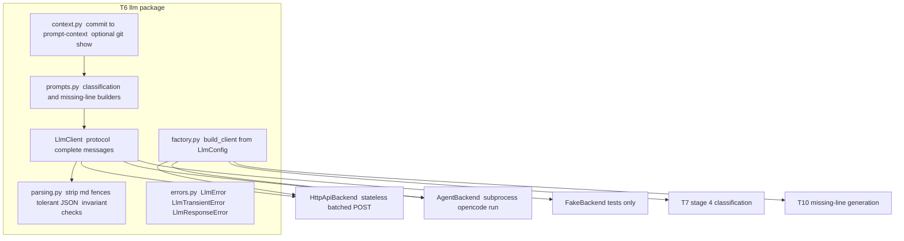

# T6 — LLM Provider Abstraction and Prompt Builders (Implementation Plan)

Source specification: [`scripts/release-helper/vibe/specification.md`](scripts/release-helper/vibe/specification.md:1)
Task breakdown: [`plans/changelog-tool-task-breakdown.md`](plans/changelog-tool-task-breakdown.md:78)

## Goal

Build a **backend-agnostic LLM layer** that the later tasks (T7 stage-4 classification,
T10 missing-line generation) call without knowing which provider is behind it. The spec
explicitly does **not** fix a concrete LLM provider or connection mechanism (§16, §4.1
`llm`), so this layer is the single seam where provider details live.

Two concrete backends ship in T6:

1. **`HttpApiBackend`** — default. A plain, stateless, batched chat-completion call
   (OpenAI-compatible HTTP). Cheap, deterministic, honors the §9.7 batch contract.
   Cannot see source code beyond the commit metadata we send.
2. **`AgentBackend`** — shells out to an agent CLI (`opencode run --format json`,
   with `codex exec --json` / `qwen` swappable by config). Runs with `cwd` set to the
   repo so the model can `git show <sha>`, grep, and read files — i.e. "походить по коду".

The backend is selected in [`scripts/release-helper/changelog.yaml`](scripts/release-helper/changelog.yaml:15)
under `llm.backend`. T7 and T10 receive a fully-built `LlmClient` and never branch on backend.

> Scope guard: T6 builds the **interface, prompts, parsing, context builder, and both
> backends**. It does **not** implement the resumable batch state machine (that is T7)
> or the missing-line generation loop (that is T10). T6 ships its own unit tests using a
> `FakeBackend` so it is independently verifiable without network or external binaries.

---

## Architecture



### Package layout (new files under `scripts/release-helper/changelog_tool/`)

```text
changelog_tool/llm/
├── __init__.py        # re-exports: build_client, LlmClient, prompt builders, parsers, errors
├── base.py            # LlmClient protocol + LlmRequest/LlmResponse dataclasses
├── errors.py          # LlmError hierarchy (transient vs permanent vs response-shape)
├── context.py         # commit -> prompt context dict; optional bounded git-show diff
├── prompts.py         # build_classification_prompt(), build_missing_line_prompt()
├── parsing.py         # extract_json_block(), parse_classification_response(), invariant checks
├── factory.py         # build_client(LlmConfig) -> LlmClient
└── backends/
    ├── __init__.py
    ├── http_api.py    # HttpApiBackend (default)
    ├── agent.py       # AgentBackend (opencode/codex/qwen subprocess)
    └── fake.py        # FakeBackend (deterministic, for tests + dry runs)
```

This mirrors the existing flat module style ([`config.py`](scripts/release-helper/changelog_tool/config.py:1),
[`models.py`](scripts/release-helper/changelog_tool/models.py:1), [`io.py`](scripts/release-helper/changelog_tool/io.py:1))
but groups LLM concerns in a subpackage because there are several files.

---

## Component details

### 1. `base.py` — the interface

- `LlmRequest` dataclass: `system: str`, `user: str`, plus optional knobs
  (`max_output_chars`, `temperature`, free-form `metadata` such as the batch id / SHAs
  for logging). Keep it provider-neutral — no message-role arrays leak to callers.
- `LlmResponse` dataclass: `text: str` (raw model output), `backend: str`, optional
  `raw` (provider payload for debugging/logging), optional `usage`.
- `class LlmClient(typing.Protocol)` with a single method:
  `complete(request: LlmRequest) -> LlmResponse`.
  - One call = one prompt = one response. **Batching, retries, and state are the
    caller's job (T7/T10)** so resumability (§9.9, §11.7, §15.7) stays in one place and
    is identical across backends.
  - The method may raise `LlmTransientError` (retryable: timeout, rate limit, 5xx,
    non-zero subprocess exit) or `LlmError` (permanent: auth/config). It must **not**
    do its own JSON validation — returning text is its only responsibility.

### 2. `errors.py`

- `LlmError(Exception)` — base.
- `LlmTransientError(LlmError)` — network/timeout/rate-limit/subprocess-failure; T7/T10
  use this to drive their retry-then-fallback logic (§9.10, §14.3).
- `LlmResponseError(LlmError)` — response could not be parsed / violated invariants;
  raised by `parsing.py`, not by backends.

### 3. `context.py` — what the model sees

- `commit_to_context(commit: Commit) -> dict` producing exactly the §9.8 fields: SHA,
  subject, body, changed_files, insertions, deletions, files_count, size_score,
  commit_url. The full diff is **not** included by default (§9.8).
- `maybe_attach_diff(context, commit, cfg)` — optional, config-gated
  (`llm.include_diff: false` default). When enabled, runs read-only
  `git show --stat --patch <sha>` via the existing git helper pattern and appends a
  **size-bounded** diff (truncated to a configurable char budget, clearly marked as
  truncated). This is the cheap way to let `HttpApiBackend` "see code" without an agent.
- For `AgentBackend`, the diff is usually **not** pre-attached — the agent fetches code
  itself; we instead pass the SHA and instruct it to inspect the repo.

### 4. `prompts.py` — prompt builders

- `build_classification_prompt(contexts: list[dict]) -> LlmRequest` — implements the
  §9.11 contract verbatim: system instruction, the category list (§9.5), inclusion
  rules (§9.6), and the strict-JSON `items`/`stats` response schema, with
  `<COMMITS_JSON>` filled from `contexts`.
- `build_missing_line_prompt(context: dict, category, maintainer_comment) -> LlmRequest`
  — implements §11.8: one short English line, no markdown bullets, no links, no invented
  facts. (Used by T10; built here so all prompt text lives in one module.)
- An **agent-flavored variant** of the system prompt for `AgentBackend` that explicitly
  invites the model to inspect the working tree (e.g. "you may run git show <sha>, read
  files, and grep") while still demanding the same strict-JSON output. Keep the JSON
  schema identical so `parsing.py` is backend-agnostic.
- Prompt-size accounting helper `estimate_chars(request)` so T7 can enforce
  `llm.max_prompt_chars` and split batches between commits (§9.7).

### 5. `parsing.py` — tolerant response handling

- `extract_json_block(text) -> str` — strip ```` ```json ```` and bare ```` ``` ````
  fences, return the inner JSON candidate (§9.10).
- `parse_classification_response(text, expected_shas) -> list[LlmClassification]`:
  1. Try `json.loads`; on failure run `extract_json_block` then retry.
  2. Validate §9.12 invariants: `stats.input_count == len(expected)`,
     `stats.output_count == len(items)`, each expected SHA returned exactly once, no
     unknown SHAs.
  3. Coerce each item into the existing [`LlmClassification`](scripts/release-helper/changelog_tool/models.py:184)
     dataclass (reusing `LlmCategory`/`Confidence` enums).
  4. On any structural failure raise `LlmResponseError` — the **caller** (T7) decides to
     retry once then write fallback `unclear` (§9.10). T6 does not own that policy.
- `parse_missing_line_response(text) -> str` — extract the single useful line from a
  possibly markdown/JSON-wrapped reply (§11.8); raise `LlmResponseError` if empty.
- `extract_agent_final_message(stdout) -> str` — `AgentBackend` helper to pull the final
  assistant text out of opencode/codex `--format json` / JSONL output before the normal
  parsers run.

### 6. `backends/http_api.py` — default backend

- Reads connection settings from **environment**, not from `changelog.yaml`
  (keys/endpoints are secrets): `CHANGELOG_LLM_API_KEY`, `CHANGELOG_LLM_BASE_URL`,
  optional `CHANGELOG_LLM_MODEL` (config `llm.model` may set a default).
- Single `POST` to an OpenAI-compatible `/chat/completions` with system+user messages;
  request JSON-object response format when supported. Uses only the stdlib
  (`urllib.request`) plus existing deps to avoid adding heavyweight requirements
  (confirm against [`requirements.txt`](scripts/release-helper/requirements.txt:1)).
- Maps timeouts / 429 / 5xx → `LlmTransientError`; 401/403/400 → `LlmError`.
- Honors `request.max_output_chars` / temperature where the API allows.

### 7. `backends/agent.py` — opencode/agent backend

- Config-driven command template, default:
  `opencode run --format json -m {model} {prompt}` executed with
  `cwd = repo.local_path` so the agent can read the checked-out tree.
- Read-only safety (§15.5): generate/point at an `opencode.json` (or pass flags) that
  sets `permission.edit = deny` and `tools.write = false`; the agent may only read /
  grep / `git show`, never modify the repo or git history. Document this in T13.
- Prompt is passed as the positional argument (opencode `run` takes the prompt as a
  positional arg; no stdin). Large prompts are written to a temp file referenced from
  the prompt if needed.
- Capture stdout, route through `extract_agent_final_message` then the shared parsers.
- Non-zero exit / timeout → `LlmTransientError`. Missing binary → `LlmError` with an
  actionable message ("install opencode or set llm.backend: http_api").
- Optional `--attach <url>` support (config `llm.agent.server_url`) to reuse a running
  `opencode serve` instance and avoid cold-start cost — wired as a pass-through flag,
  not required for MVP.
- **Granularity note:** an agent run is naturally one task at a time. `AgentBackend`
  therefore exposes the same `complete()` method, but T7 will call it **per commit** (or
  tiny groups) rather than batches of 20. The §9.12 batch invariants still apply to each
  single-commit "batch" (input_count==1, one SHA back). This keeps `parsing.py` uniform.

### 8. `factory.py` — selection

- `build_client(cfg: LlmConfig) -> LlmClient` returns the backend named by `cfg.backend`
  (`http_api` default, `agent`, `fake`). Raises `ConfigError`/`LlmError` for unknown
  backend or missing required settings.
- Centralizes "which backend" so T7/T10 just call `build_client(config.llm)`.

### 9. `backends/fake.py` — tests & dry runs

- Deterministic backend that returns canned JSON for given SHAs (configurable mapping),
  used by T6/T7 unit tests and a `--dry-run` style smoke test without network/binaries.

---

## Configuration additions (T1 `LlmConfig` extension)

Extend [`LlmConfig`](scripts/release-helper/changelog_tool/config.py:62) and `_parse_llm`
with new **optional** fields (defaults keep current behavior; no breaking change):

```yaml
llm:
  batch_size: 20
  max_prompt_chars: 50000
  backend: http_api          # http_api | agent | fake   (default http_api)
  model: null                # provider/model string; backend-specific default if null
  include_diff: false        # http_api: attach bounded git-show diff to context
  diff_max_chars: 20000      # truncation budget when include_diff is true
  agent:                     # only used when backend == agent
    command: opencode        # binary name
    extra_args: []           # e.g. ["--format", "json"]
    server_url: null         # optional: attach to `opencode serve`
    timeout_seconds: 600
```

- Secrets (API key, base URL) stay in **environment variables**, never in the YAML
  (matches §15.x safety intent). Document the env var names in T13.
- Validation: `backend` must be one of the known values; `agent.timeout_seconds` positive;
  `diff_max_chars` positive. Reuse the existing `_positive_int` / mapping helpers.

---

## Testing plan (`scripts/release-helper/tests/`)

New test modules, following the existing pytest style in
[`tests/test_classifier.py`](scripts/release-helper/tests/test_classifier.py:1):

- `test_llm_parsing.py` — fenced-block extraction; valid JSON; missing/extra/duplicate
  SHA → `LlmResponseError`; `stats` mismatch; missing-line extraction; agent final-message
  extraction from sample opencode/codex JSON output.
- `test_llm_prompts.py` — classification prompt contains all §9.5 categories, the strict
  JSON schema, and every input SHA; missing-line prompt enforces the §11.8 constraints;
  `estimate_chars` is monotonic.
- `test_llm_context.py` — `commit_to_context` emits exactly the §9.8 field set and omits
  the diff by default; `maybe_attach_diff` truncates to `diff_max_chars` and marks
  truncation; uses a fake git runner (no real repo).
- `test_llm_factory.py` — `build_client` returns the right backend per config; unknown
  backend raises; `agent` backend with missing binary raises a clear `LlmError`.
- `test_llm_backends.py` — `HttpApiBackend` with a stubbed `urllib` (transient vs
  permanent error mapping); `AgentBackend` with a fake subprocess runner (stdout parsing,
  non-zero exit → transient, missing binary → permanent); `FakeBackend` returns canned data.

All tests run offline: HTTP via stubbed opener, agent via injected subprocess runner,
git via injected command runner. No real network, binaries, or repo required.

---

## Definition of done for T6

- `changelog_tool/llm/` package exists with the interface, prompts, parsing, context,
  factory, errors, and three backends (`http_api`, `agent`, `fake`).
- `LlmConfig` parses the new optional fields with defaults and validation; existing
  configs keep working unchanged.
- All prompt text matches the spec contracts (§9.11, §11.8); parsing enforces §9.10 and
  §9.12; context matches §9.8.
- Backend selection works via `llm.backend`; secrets come from environment.
- `AgentBackend` runs read-only (no repo/git mutation, §15.5).
- Unit tests above pass offline.
- **Not** in scope: the resumable batch state machine (T7) and the missing-line
  generation loop (T10) — T6 only provides the building blocks they consume.

---

## Follow-on impact (for awareness, handled in their own tasks)

- **T7** consumes `build_client` + `build_classification_prompt` + `parse_classification_response`,
  owns batching/`max_prompt_chars` splitting, the `04_llm_classification_state.json` state
  machine, retry-once-then-`unclear` fallback, and oversized-commit fallback (§9.7, §9.9,
  §14.10). For `AgentBackend`, T7 iterates per commit instead of per batch.
- **T10** consumes `build_missing_line_prompt` + `parse_missing_line_response` and owns
  `06_changelog_line_generation_state.json` + TODO fallback (§11.7).
- **T13** documents env vars, the `opencode` setup + read-only `opencode.json`, and the
  `llm.backend` switch.
