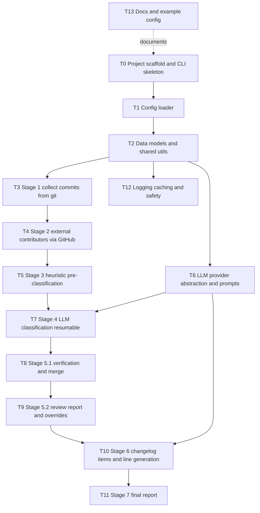

# Task Breakdown: CHANGELOG Preparation Tool

Source specification: [`scripts/release-helper/vibe/specification.md`](scripts/release-helper/vibe/specification.md:1)

Stack: Python (consistent with existing `scripts/` tooling), CLI via argparse/click, config via PyYAML.

This document only splits the work into discrete tasks. Detailed implementation plans for each task are intentionally **not** included yet.

---

## Task Dependency Overview

---

## T0 — Project scaffold and CLI skeleton
- Create package layout under `scripts/release-helper/` (e.g. `changelog_tool/` package + entry point).
- Implement the `changelog-tool` CLI with three subcommands: `collect`, `review`, `report`.
- Wire global flags (e.g. `--config`, `--from`, `--to`) and command-to-stage mapping (collect→1-4, review→5, report→6-7).
- Stub command handlers that other tasks fill in.

## T1 — Configuration loader (`changelog.yaml`)
- Parse `changelog.yaml`: `repo`, `range`, `thresholds`, `llm`, `core_team`, `output`.
- Support CLI flag overrides for `range.from` / `range.to`.
- Validate required fields and apply defaults (workdir `.changelog`, threshold defaults).

## T2 — Data models and shared utilities
- Define `Commit`, `CoAuthor`, classification structures (auto/llm/verified) and item models.
- Implement size_score and size_bucket logic (Spec 5.2, 5.3).
- Implement SHA checksum helper: `sha256("\n".join(sorted(full_sha_list)))` (Spec 6.7).
- JSONL read/write helpers and atomic file writes.

## T3 — Stage 1: Collect commits from git
- Run `git log <from>..<to>` (read-only), no `--no-merges`.
- Extract all per-commit fields incl. merge flag (parents_count > 1), changed files, insertions/deletions.
- Parse `Co-authored-by:` trailers into `co_authors`.
- Build commit URLs from `repo.github_url`.
- Write `01_commits.jsonl` and `01_commits_manifest.json`; enforce uniqueness/total/checksum invariants (Spec 6.8).

## T4 — Stage 2: Identify external contributors
- Resolve GitHub login/profile for authors and co-authors (GitHub API by SHA + optional email→login mapping).
- Handle `UNKNOWN` login → mark external + attention.
- Apply external rule against `core_team.logins` for authors AND co-authors (Spec 7.6).
- Write `02_commits_with_contributors.jsonl` and `02_external_contributors.md`.

## T5 — Stage 3: Automatic pre-classification (heuristics)
- Implement the 5 ordered rules: merge → docs-by-subject → fix/bug-by-subject+size → small-size → send-to-LLM (Spec 8.5–8.10).
- Attach `auto_classification` object per commit.
- Write `03_preclassified.jsonl`; enforce invariants (all SHAs present, boolean `send_to_llm`).

## T6 — LLM provider abstraction and prompt builders
- Define a provider-agnostic LLM client interface (connection details not fixed by spec).
- Build classification prompt (Spec 9.11) and missing-line prompt (Spec 11.8).
- Implement response cleanup: extract JSON from Markdown code blocks; tolerant parsing (Spec 9.10).

## T7 — Stage 4: LLM classification (resumable)
- Select only `send_to_llm == true` commits.
- Batching respecting `batch_size` and `max_prompt_chars`; split only between commits; oversized single commit → fallback `unclear` + attention (Spec 9.7, 14.10).
- Resumable state machine in `04_llm_classification_state.json` (statuses pending/in_progress/done/failed/skipped; stale in_progress restart; immediate persistence) (Spec 9.9).
- Per-batch invariant checks; retry once then fallback `unclear` (Spec 9.10, 9.12).
- Write `04_llm_classified.jsonl`.

## T8 — Stage 5.1: Verification and merge
- Merge auto/llm classification per SHA into unified objects (Spec 10.1 merge rules).
- Run mandatory checks: same SHA set, checksum match, no duplicates, all classified, LLM output complete, no unfinished mandatory batches.
- Write `05_verified_classification.jsonl` and `05_verification_report.json`; fail `review` on any failed check.

## T9 — Stage 5.2: Review report and overrides
- Generate `05_review_report.md` with full required field set, sorted by `size_score DESC`, plus attention flags (Spec 10.2.1–10.2.3).
- Create/handle `05_review_overrides.yaml` safely: keep / merge / backup-and-regenerate; default `keep` non-interactive (Spec 10.2.4, 14.7).

## T10 — Stage 6: Generate CHANGELOG items + missing-line generation
- Apply overrides; select `candidate_for_changelog == true`.
- Map categories → sections; unmapped overridden candidates → `Other` (Spec 11.6).
- Resumable missing-line generation in `06_changelog_line_generation_state.json`; TODO fallback line + attention flag (Spec 11.7).
- Write `06_changelog_items.jsonl`.

## T11 — Stage 7: Final report
- Produce `07_final_report.md`: proposed CHANGELOG, external contributors, verification status, statistics, human-attention items (incl. TODO-fallback lines), appendix with all commits (Spec 12.4).

## T12 — Cross-cutting: logging, caching, safety
- Per-command logs under `.changelog/logs/` with required metrics (Spec 15.4).
- Without caching
- Enforce read-only git, idempotency, and protection of user-editable files (Spec 15.1, 15.5, 15.6).
- Standardized error messages/exit codes (Spec 14.1–14.9).

## T13 — Documentation and example config
- README for `scripts/release-helper/` describing the three-command workflow.
- Provide example `changelog.yaml`.
- Document artifact layout (Spec 19) and resume behavior.
